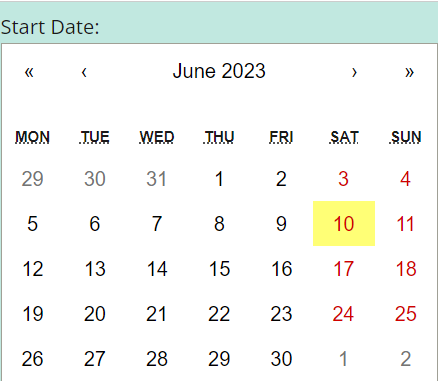
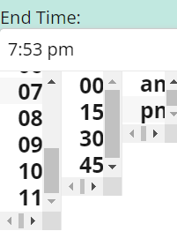

# Club-Hub


## Description 

Club Hub is an application that allows multiple users to access a community calendar of events for their club or organization.

--------------------------------------------------------------

[Check out the site live here!](https://clubhub.herokuapp.com/)

---------------------------------------------------------------

If you have found this blog outside of GitHub and wish to view the original, [visit our Repository link here.](https://github.com/tdusenbury/Club-Hub)


--------------------------------------------------------------

The below image shows that when the site loads, you are presented with the Club Hub home page:


----------------------------------------------------------------------

## Table of Contents

  - [**Description**](#description)
  - [**Technology Used**](#technology-used)
  - [**Code Examples**](#code-examples)
  - [**New Technology Used**](#new-technology-used)
  - [**Usage**](#usage)
  - [**Author Info**](#author-info)
  - [**Contributing**](#contributing)
  - [**License**](#license)


---------------------------------------------------------------

## Technology Used 

[](https://skillicons.dev) 

| Other Technologies Used         | Resource URL           | 
| ------------- |:-------------:| 
| Anime.js  | [https://animejs.com/documentation](https://animejs.com/documentation) |
| React Calendar | [https://www.npmjs.com/package/react-calendar](https://www.npmjs.com/package/react-calendar) |
| RC Time Picker | [https://www.npmjs.com/package/rc-time-picker](https://www.npmjs.com/package/rc-time-picker) |
| Bcrypt.js | [https://animejs.com/documentation](https://animejs.com/documentation) |
| Dotenv    | [https://www.npmjs.com/package/dotenv](https://www.npmjs.com/package/dotenv) |
| Mongoose  | [https://mongoosejs.com/docs](https://mongoosejs.com/docs) |
| JSON Web Token | [https://www.npmjs.com/package/jsonwebtoken](https://www.npmjs.com/package/jsonwebtoken) |
| Apollo Server Express | [https://www.npmjs.com/package/apollo-server-express](https://www.npmjs.com/package/apollo-server-express) |


--------------------------------------------------------------

## Code Examples
### A part of our TypeDef with its Queries
```JS
type Event {
    _id: ID
    name: String!
    location: String!
    startTime: String
    startDate: String!
    endTime: String
    endDate: String!
    description: String
    eventCreator: User
    attendingUsers: [User]
  }

  type Auth {
    token: ID!
    user: User
  }

  type Query {
    getMembers: [User]
    getMe: User
    getEvent(_id:ID!): Event
    getAllEvents: [Event]
    getMyEvents: [Event]
    getAttendingEvents:[Event]
    getFutureEvents: [Event]
    getUserEvent(userID:ID!): [Event]
  }
```

### One of our Mutation in Resolvers which is responsible for RSVP
```JS
addUserEvent: async (parent, { eventId }, context) => {
  if (context.user) {
    const userId = context.user._id;
    const updatedEvent = await Event.findOneAndUpdate(
      { _id: eventId },
      { $addToSet: { attendingUsers: userId } },
      { new: true }
    );
    const updatedUser = await User.findOneAndUpdate(
      { _id: userId },
      { $addToSet: { events: eventId } },
      { new: true }
    );
    return updatedUser;
  }
  throw new AuthenticationError('You need to be logged in!');
},
```
### Using ApolloProvider and Routes
```JS
<ApolloProvider client={client}>
  <Router>
    <Header />
    <div className="flex-column justify-space-evenly min-100-vh">

      <Routes>
        <Route
          path="/"
          element={<Home />}
        />
        <Route
          path="/login"
          element={<Login />}
        />
        <Route
          path="/signup"
          element={<Signup />}
        />
        <Route
          path="/clubhomepage"
          element={<ClubHomePage />}
        />
```

### Example of using JSX in React
```JS
<div>
  <div className="event-card">
      <h2 className="name">{name}</h2>
      <div className="event-details">
          <p><strong>Name:</strong> {name}</p>
          <p><strong>Location:</strong> {location}</p>
          <p>{startTime?.length > 0 && <strong>Start Time: {newStartTime}</strong>}</p>
          <p><strong>Start Date:</strong> {formattedStartDate}</p>
          <p>{endTime?.length > 0 && <strong>End Time: {newEndTime} <br /></strong>}</p>
          <p><strong>End Date:</strong> {formattedEndDate} <br /></p>
          <p><strong>Description:</strong> {description}</p>
      </div>
      <div className="event-buttons">
          <button id="button" onClick={handleRemoveRSVPEvent} >
              Revoke RSVP
          </button>
      </div>

      {error && <div className="error-message" style={{ color: 'red' }}>{error.message}</div>}
  </div >
</div >
``` 
### An example of caching
```JS
const [createEvent, { error }] = useMutation(ADD_EVENT, {
  update(cache, { data: { createEvent } }) {
    try {
        const cacheResponse = cache.readQuery({ query: QUERY_MY_EVENTS });
        if (cacheResponse && cacheResponse.getMyEvents) {
            cache.writeQuery({
                query: QUERY_MY_EVENTS,
                data: { getMyEvents: [createEvent, ...cacheResponse.getMyEvents] },
            });
        }
    } catch (e) {
        console.error(e);
    }
    try {
        const cacheResponse = cache.readQuery({ query: QUERY_FUTURE_EVENTS });
        if (cacheResponse && cacheResponse.getFutureEvents) {
            cache.writeQuery({
                query: QUERY_FUTURE_EVENTS,
                data: { getFutureEvents: [createEvent, ...cacheResponse.getFutureEvents] },
            });
        }
    } catch (e) {
        console.error(e);
    }
  },
});
```
### Sending request from client to server for executing the mutation of createEvent
```JS
try {
  const { data } = await createEvent({
      variables: {
          name: eventData.name,
          location: eventData.location,
          startTime: eventData.startTime,
          startDate: new Date(eventData.startDate).getTime().toString(),
          endTime: eventData.endTime,
          endDate: new Date(eventData.endDate).getTime().toString(),
          description: eventData.description

      },
  });

  setEventData({
      name: '',
      location: '',
      startTime: '',
      startDate: '',
      endTime: '',
      endDate: '',
      description: ''
  });
  setEventCreated(true);
} catch (err) {
  console.error(err);
}
```

## New Technology Used

--------------------------------------------------------------
### 1. React Calendar library
### Code Snippet

```jS
<div className="Date">
  <label>End Date:</label>
  <Calendar value={eventData.endDate} onChange={(date) => setEventData((prevData) => ({ ...prevData, endDate: date }))} />
  {errors.endDate && <span style={{ color: 'red' }}>{errors.endDate}</span>}
</div>
```
### image


### 2. RC Time Picker library
### Code Snippet
```JS
const timePickerStyle = {
  '.rcTimePickerClear': {
    display: 'none',
  },
};

const MyClock = ({ selectedTime, onTimeChange }) => {
  const str = 'HH:mm a';
  function onChange(value) {
    onTimeChange(value.format(str));
    selectedTime = value.format(str);

  }
  return (
    <div style={timePickerStyle}>
      <TimePicker
        use12Hours={true}
        style={{ width: 100 }}
        showSecond={false}
        allowEmpty={false}
        defaultValue={moment()}
        minuteStep={15}
        onChange={onChange}
      />
    </div>
  );
};
```
### image


### 3. Anime.js library
### Code Snippet
```JS
useEffect(() => {
  const interval = setInterval(() => {
    anime({
      targets: 'h1',
  keyframes: [
    {translateY: -10},
    {translateX: 50},
    {translateY: 20},
    {translateX: 0},
    {translateY: 0}
  ],
  duration: 4000,
  easing: 'easeOutElastic(1, .8)',
    });
  }, 10000);

  return () => clearInterval(interval);
}, []);
```
### Gif


--------------------------------------------------------------

## Usage 

This application allows members of a club to view other members, view current club events, RSVP to an event, and add new events. 

*************
When a user loads the site, they are directed to a main home page where they can choose to login, sign up, or view the "About" page:


****************
Once logged in, a user arrives at the Club Hub Home Page where they are given a list of scheduled club events:


*****************

## Author Info
This is a group collaboration. Below you can find the contact information for all developers:

Afi Nkhume-Crecy
- [**Github**](https://github.com/AFICRECY)
- [**LinkedIn**](https://www.linkedin.com/in/afi-nkhume-crecy-932862128/)
- [**Email**](mailto:aficrecy@gmail.com)


Bahareh Hosseini
- [**Github**](https://github.com/Bhmerir)
- [**LinkedIn**](https://www.linkedin.com/in/bahareh-hosseini-86a43453/)
- [**Email**](mailto:mer_ir@yahoo.com)


Liubov Sobolevskaya
- [**Github**](https://github.com/LiubovSobolevskaya)
- [**LinkedIn**](https://www.linkedin.com/in/liubov-sobolevskaya/)
- [**Email**](mailto:lubava39@gmail.com)

Tamara "T" Dusenbury
  
- [**Github**](https://github.com/tdusenbury)
- [**LinkedIn**](https://linkedin.com/in/tamara-dusenbury-02ab8591)
- [**Email**](mailto:tamara.dusenbury@gmail.com)


-----------------------------------------------------------------

## Contributing

If you would like to contribute, please follow the [Contributor Covenant](https://www.contributor-covenant.org/).

[](code_of_conduct.md)

----------------------------------------------------------------------

## License

This projects holds an MIT License.
