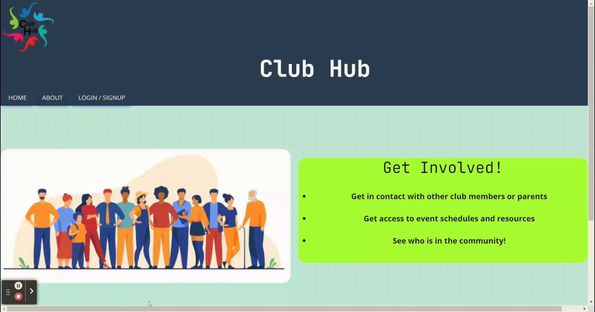
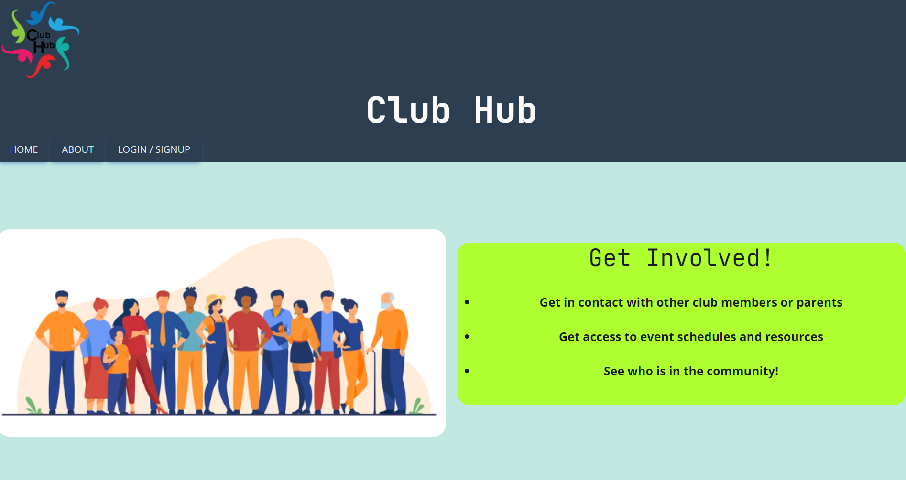
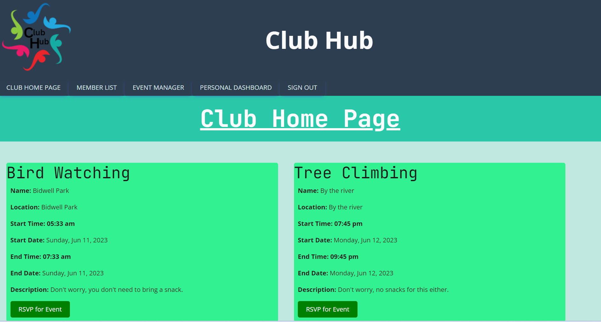

# Club-Hub

## Description 

Club Hub is an application that allows multiple users to access a community calendar of events for their club or organization.

--------------------------------------------------------------

[Check out the site live here!](https://clubhub.herokuapp.com/)

---------------------------------------------------------------

If you have found this blog outside of GitHub and wish to view the original, [visit our Repository link here.](https://github.com/tdusenbury/Club-Hub)

--------------------------------------------------------------

The below image shows that when the site loads, you are presented with the Club Hub home page:

----------------------------------------------------------------------

## Table of Contents

  - [**Description**](#description)
  - [**Technology Used**](#technology-used)
  - [**Code Examples**](#code-examples)
  - [**New Technology Used**](#new-technology-used)
  - [**Usage**](#usage)
  - [**Author Info**](#author-info)
  - [**Contributing**](#contributing)
  - [**License**](#license)

---------------------------------------------------------------

## Technology Used 

|  

--------------------------------------------------------------

## Usage 

This application allows members of a club to view other members, view current club events, RSVP to an event, and add new events. 

*************
When a user loads the site, they are directed to a main home page where they can choose to login, sign up, or view the "About" page:

****************
Once logged in, a user arrives at the Club Hub Home Page where they are given a list of scheduled club events:

*****************

## Author Info
This is a group collaboration. Below you can find the contact information for all developers:

Afi Nkhume-Crecy
- [**Github**](https://github.com/AFICRECY)
- [**LinkedIn**](https://www.linkedin.com/in/afi-nkhume-crecy-932862128/)
- [**Email**](mailto:aficrecy@gmail.com)

Bahareh Hosseini
- [**Github**](https://github.com/Bhmerir)
- [**LinkedIn**](https://www.linkedin.com/in/bahareh-hosseini-86a43453/)
- [**Email**](mailto:mer_ir@yahoo.com)

Liubov Sobolevskaya
- [**Github**](https://github.com/LiubovSobolevskaya)
- [**LinkedIn**](https://www.linkedin.com/in/liubov-sobolevskaya/)
- [**Email**](mailto:lubava39@gmail.com)

Tamara "T" Dusenbury
  
- [**Github**](https://github.com/tdusenbury)
- [**LinkedIn**](https://linkedin.com/in/tamara-dusenbury-02ab8591)
- [**Email**](mailto:tamara.dusenbury@gmail.com)

-----------------------------------------------------------------

## Contributing

If you would like to contribute, please follow the [Contributor Covenant](https://www.contributor-covenant.org/).

----------------------------------------------------------------------

## License

This projects holds an MIT License.
