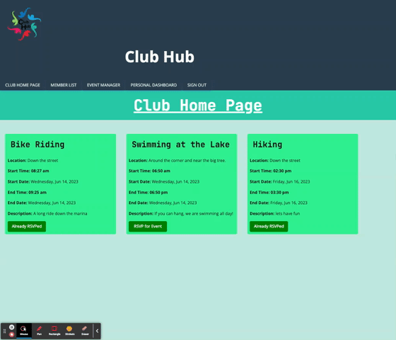

# Club-Hub
## Description 

Welcome to Club Hub, your ultimate destination for connection and community. Our user-friendly website serves as your gateway to becoming a valued member, offering tailored features and a seamless interface. Discover a world of possibilities as we bring together a diverse community, empowering you to explore various club events and establish meaningful connections. Gain access to our comprehensive member database, connecting you with like-minded individuals and expanding your social circle. At Club Hub, we prioritize your experience, providing a seamless journey from start to finish. Stay up-to-date with upcoming club events, effortlessly RSVP, and easily access contact information of fellow members. Our web application is built aiming to connect members of our Club to bond over group events and the desire to create unforgettable experiences together. Experience the power of connection and community at Club Hub!
 ### Features:
* User-friendly interface and tailored features.
* Club coordination, event management, and member networking.
* Comprehensive member database for connecting with member information.
* Stay updated with upcoming club events, RSVP effortlessly.
* The ability for the user to change/update their own personal information.

</br>

[Check out the site live here!](https://clubhub.herokuapp.com/)


 [Visit our Repository link here.](https://github.com/tdusenbury/Club-Hub)

</br>

--------------------------------------------------------------


The below image shows that when the site loads, you are presented with the Club Hub home page:


----------------------------------------------------------------------

## Table of Contents

  - [**Description**](#description)
  - [**Technology Used**](#technology-used)
  - [**Installation**](#installation)
  - [**Code Examples**](#code-examples)
  - [**Technology Used**](#technology-used)
  - [**New Technology Used**](#new-technology-used)
  - [**Responsivness**](#responsivness)
  - [**Usage**](#usage)
  - [**Author Info**](#author-info)
  - [**Contributing**](#contributing)
  - [**License**](#license)


---------------------------------------------------------------

## Technology Used 

[](https://skillicons.dev) 

| Other Technologies Used         | Resource URL           | 
| ------------- |:-------------:| 
| Anime.js  | [https://animejs.com/documentation](https://animejs.com/documentation) |
| React Calendar | [https://www.npmjs.com/package/react-calendar](https://www.npmjs.com/package/react-calendar) |
| RC Time Picker | [https://www.npmjs.com/package/rc-time-picker](https://www.npmjs.com/package/rc-time-picker) |
| Bcrypt.js | [https://animejs.com/documentation](https://animejs.com/documentation) |
| Dotenv    | [https://www.npmjs.com/package/dotenv](https://www.npmjs.com/package/dotenv) |
| Mongoose  | [https://mongoosejs.com/docs](https://mongoosejs.com/docs) |
| JSON Web Token | [https://www.npmjs.com/package/jsonwebtoken](https://www.npmjs.com/package/jsonwebtoken) |
| Apollo Server Express | [https://www.npmjs.com/package/apollo-server-express](https://www.npmjs.com/package/apollo-server-express) |

--------------------------------------------------------------


## Installation
To install this project, a knowledge of HTML, CSS, JavaScript, Node.js, Express.js, and ReactJS framework (JSX), Git, and Github Pages were required. We installed the respective and NPM packages and the following dependencies (express, User token Authentication, reactJS, Bootstrap, animejs, google fonts, react-calendar library, rc-time-picker, and nodemon). In order to create this application, a foundational knowledge of CSS, and JavaScript, amd ReactJS were required in order to utilize all programming languages on the same code file. HTML was used in the form of JSX within a .js file. Additionally, each navigation tab at the top of Club Hub webpage is organized into separate different pages and their component files. Bootstrap styling framework was used in order to organize both our grid layouts, forms and input sections, and also to help create the event cards. By combining these technologies, our team created a clean and visually pleasing user friendly web application that allows users to coordinate events, connect with one another from our usage of MongoDB Databases to make member information avaialble, and lastly, help members create and participate in club events. The user should be able to [Check out the site live here!](https://clubhub.herokuapp.com/)

</br>

## Code Examples

### A part of our TypeDef with its Queries
```JS
type Event {
    _id: ID
    name: String!
    location: String!
    startTime: String
    startDate: String!
    endTime: String
    endDate: String!
    description: String
    eventCreator: User
    attendingUsers: [User]
  }

  type Auth {
    token: ID!
    user: User
  }

  type Query {
    getMembers: [User]
    getMe: User
    getEvent(_id:ID!): Event
    getAllEvents: [Event]
    getMyEvents: [Event]
    getAttendingEvents:[Event]
    getFutureEvents: [Event]
    getUserEvent(userID:ID!): [Event]
  }
```
</br>

### One of our Mutation in Resolvers which is responsible for RSVP

```JS
addUserEvent: async (parent, { eventId }, context) => {
  if (context.user) {
    const userId = context.user._id;
    const updatedEvent = await Event.findOneAndUpdate(
      { _id: eventId },
      { $addToSet: { attendingUsers: userId } },
      { new: true }
    );
    const updatedUser = await User.findOneAndUpdate(
      { _id: userId },
      { $addToSet: { events: eventId } },
      { new: true }
    );
    return updatedUser;
  }
  throw new AuthenticationError('You need to be logged in!');
},
```

### Using ApolloProvider and Routes
```JS
<ApolloProvider client={client}>
  <Router>
    <Header />
    <div className="flex-column justify-space-evenly min-100-vh">

      <Routes>
        <Route
          path="/"
          element={<Home />}
        />
        <Route
          path="/login"
          element={<Login />}
        />
        <Route
          path="/signup"
          element={<Signup />}
        />
        <Route
          path="/clubhomepage"
          element={<ClubHomePage />}
        />
```

### Example of using JSX in React
```JS
<div>
  <div className="event-card">
      <h2 className="name">{name}</h2>
      <div className="event-details">
          <p><strong>Name:</strong> {name}</p>
          <p><strong>Location:</strong> {location}</p>
          <p>{startTime?.length > 0 && <strong>Start Time: {newStartTime}</strong>}</p>
          <p><strong>Start Date:</strong> {formattedStartDate}</p>
          <p>{endTime?.length > 0 && <strong>End Time: {newEndTime} <br /></strong>}</p>
          <p><strong>End Date:</strong> {formattedEndDate} <br /></p>
          <p><strong>Description:</strong> {description}</p>
      </div>
      <div className="event-buttons">
          <button id="button" onClick={handleRemoveRSVPEvent} >
              Revoke RSVP
          </button>
      </div>

      {error && <div className="error-message" style={{ color: 'red' }}>{error.message}</div>}
  </div >
</div >
``` 
### An example of caching
```JS
const [createEvent, { error }] = useMutation(ADD_EVENT, {
  update(cache, { data: { createEvent } }) {
    try {
        const cacheResponse = cache.readQuery({ query: QUERY_MY_EVENTS });
        if (cacheResponse && cacheResponse.getMyEvents) {
            cache.writeQuery({
                query: QUERY_MY_EVENTS,
                data: { getMyEvents: [createEvent, ...cacheResponse.getMyEvents] },
            });
        }
    } catch (e) {
        console.error(e);
    }
    try {
        const cacheResponse = cache.readQuery({ query: QUERY_FUTURE_EVENTS });
        if (cacheResponse && cacheResponse.getFutureEvents) {
            cache.writeQuery({
                query: QUERY_FUTURE_EVENTS,
                data: { getFutureEvents: [createEvent, ...cacheResponse.getFutureEvents] },
            });
        }
    } catch (e) {
        console.error(e);
    }
  },
});
```
### Sending request from client to server for executing the mutation of createEvent
```JS
try {
  const { data } = await createEvent({
      variables: {
          name: eventData.name,
          location: eventData.location,
          startTime: eventData.startTime,
          startDate: new Date(eventData.startDate).getTime().toString(),
          endTime: eventData.endTime,
          endDate: new Date(eventData.endDate).getTime().toString(),
          description: eventData.description

      },
  });

  setEventData({
      name: '',
      location: '',
      startTime: '',
      startDate: '',
      endTime: '',
      endDate: '',
      description: ''
  });
  setEventCreated(true);
} catch (err) {
  console.error(err);
}
```
</br>

--------------------------------------------------------------

## New Technology Used


## 1. React Calendar library
### Code Snippet

```jS
<div className="Date">
  <label>End Date:</label>
  <Calendar value={eventData.endDate} onChange={(date) => setEventData((prevData) => ({ ...prevData, endDate: date }))} />
  {errors.endDate && <span style={{ color: 'red' }}>{errors.endDate}</span>}
</div>
```
### image


## 2. RC Time Picker library
### Code Snippet
```JS
const timePickerStyle = {
  '.rcTimePickerClear': {
    display: 'none',
  },
};

const MyClock = ({ selectedTime, onTimeChange }) => {
  const str = 'HH:mm a';
  function onChange(value) {
    onTimeChange(value.format(str));
    selectedTime = value.format(str);

  }
  return (
    <div style={timePickerStyle}>
      <TimePicker
        use12Hours={true}
        style={{ width: 100 }}
        showSecond={false}
        allowEmpty={false}
        defaultValue={moment()}
        minuteStep={15}
        onChange={onChange}
      />
    </div>
  );
};
```
### image


## 3. Anime.js library
### Code Snippet
```JS
useEffect(() => {
  const interval = setInterval(() => {
    anime({
      targets: 'h1',
  keyframes: [
    {translateY: -10},
    {translateX: 50},
    {translateY: 20},
    {translateX: 0},
    {translateY: 0}
  ],
  duration: 4000,
  easing: 'easeOutElastic(1, .8)',
    });
  }, 10000);

  return () => clearInterval(interval);
}, []);
```
### Gif


</br>

--------------------------------------------------------------

## Responsivness



</br>

--------------------------------------------------------------
## Usage 

Our Club Hub web application is dynamic and incredibly useful for individuals and groups looking to engage in club activities, networking, and community-building. Here are some key benefits:
Simplified Club Coordination: The platform streamlines club coordination, making it easier for club organizers to manage activities, see other member contact information to connect, change user personal information,and plan events effectively.

<ins>Effortless Event Management:</ins> 
Users can stay informed about upcoming club events, receive event reminders, and easily RSVP. This simplifies the event management process and ensures better attendance and participation.

<ins>Expanded Member Networking:</ins> 
By accessing a comprehensive member database, users can connect with like-minded individuals, professionals, and potential collaborators. This expands their network, fosters new relationships, and opens doors for various opportunities.

<ins>Personalized Club Experience:</ins> 
Members can tailor their club experiences by exploring a wide range of club events aligned with their interests. They can join clubs that resonate with their passions, enabling them to engage deeply and find like-minded individuals.

<ins>Community Engagement and Support:</ins> 
The platform cultivates a vibrant community where members can interact, share ideas, and support one another. It encourages collaboration, knowledge sharing, and the creation of memorable experiences together.
In summary, such a website provides a centralized platform for club activities, event management, networking, and community-building, enhancing the overall club experience and fostering meaningful connections among members.

</br>
</br>

*************
## When a user loads the site, they are directed to a main home page where they can choose to login, sign up, or view the "About" page:


</br>
</br>

****************
## Once logged in, a user arrives at the Club Hub Home Page where they are given a list of scheduled club events:


</br>

*****************

## Author Info
This is a group collaboration. Below you can find the contact information for all developers:

Afi Nkhume-Crecy
- [**Github**](https://github.com/AFICRECY)
- [**LinkedIn**](https://www.linkedin.com/in/afi-nkhume-crecy-932862128/)
- [**Email**](mailto:aficrecy@gmail.com)


Bahareh Hosseini
- [**Github**](https://github.com/Bhmerir)
- [**LinkedIn**](https://www.linkedin.com/in/bahareh-hosseini-86a43453/)
- [**Email**](mailto:mer_ir@yahoo.com)


Liubov Sobolevskaya
- [**Github**](https://github.com/LiubovSobolevskaya)
- [**LinkedIn**](https://www.linkedin.com/in/liubov-sobolevskaya/)
- [**Email**](mailto:lubava39@gmail.com)

Tamara "T" Dusenbury
  
- [**Github**](https://github.com/tdusenbury)
- [**LinkedIn**](https://linkedin.com/in/tamara-dusenbury-02ab8591)
- [**Email**](mailto:tamara.dusenbury@gmail.com)


-----------------------------------------------------------------

## Contributing

If you would like to contribute, please follow the [Contributor Covenant](https://www.contributor-covenant.org/).

[](code_of_conduct.md)

----------------------------------------------------------------------

## License

Copyright (c) Microsoft Corporation. All rights reserved.

Licensed under the MIT license.
</br>


